# Captify Workshops - Development Process Standard

## Purpose

The workshops directory is the **single source of truth** for all product development across Captify applications. It provides a standardized structure for documenting, planning, and tracking the implementation of applications and components.

**This document defines the workshop process standard and should rarely change.**

---

## Table of Contents

**Quick Navigation for AI Agents:**

1. **[Quick Start for AI Agents](#quick-start-for-ai-agents)** ⭐ START HERE - YAML user stories & test generation
2. **[Development Standards for AI Agents](#development-standards-for-ai-agents)** ⭐ CRITICAL - Code standards & architecture
3. **[AI Agent Workflow for New Applications](#ai-agent-workflow-for-new-applications)** ⭐ WORKFLOW - 7-phase TDD process
4. [What is a Workshop?](#what-is-a-workshop) - Structure overview
5. [Standard Files](#standard-files-required-for-every-workshop) - Required documentation
6. [Test-Driven Development Workflow](#test-driven-development-workflow) - TDD process
7. [Workshop Process for AI Agents](#workshop-process-for-ai-agents) - Step-by-step guidance
8. [Quality Checklist](#quality-checklist) - Pre-completion verification
9. [Creating a New Workshop](#creating-a-new-workshop) - New project setup

---

## Quick Start for AI Agents

**IMPORTANT: User stories are now in YAML format for automated test generation.**

### Using YAML User Stories

1. **Read YAML user stories** (not markdown):
   ```bash
   cat workshops/{app}/user-stories/01-feature-name.yaml
   ```

2. **Validate YAML** before using:
   ```bash
   tsx workshops/scripts/validate-user-stories.ts
   # Or: npm run validate:stories
   ```

3. **Auto-generate tests** from YAML:
   ```bash
   tsx workshops/scripts/generate-tests-from-yaml.ts workshops/{app}/user-stories/01-feature-name.yaml
   # Or: npm run generate:tests -- workshops/{app}/user-stories/01-feature-name.yaml
   ```

4. **Run generated tests** (TDD Red phase):
   ```bash
   npm test -- 01-feature-name.test.ts
   # Expected: Tests fail (implementation doesn't exist yet)
   ```

5. **Implement code** to pass tests (TDD Green phase)

6. **Deploy and document** (see AI Agent Workflow section below)

### Why YAML?

- ✅ **Machine-readable** - Easy for AI agents to parse and understand
- ✅ **Automated tests** - Generate Jest tests automatically from requirements
- ✅ **Schema validation** - Catch errors before implementation
- ✅ **Structured data** - Query with tools like `yq`, integrate with CI/CD
- ✅ **Single source** - Requirements AND tests in one file

### YAML Structure Quick Reference

```yaml
feature:
  id: "01"                    # Feature number
  name: "Feature Name"        # Human-readable
  priority: "P0"              # P0-P3
  story_points: 5             # Fibonacci estimate

services_required:            # From @captify-io/core
  - "@captify-io/core/lib/api"

aws_services:                 # AWS services used
  - dynamodb
  - cognito

tables:                       # DynamoDB tables (short format)
  - core-user

stories:                      # User stories with tests
  - id: "US-01-01"
    title: "Feature title"
    as_a: "User type"
    i_want: "Goal"
    so_that: "Benefit"

    acceptance_criteria:      # Must have ≥1
      - condition: "When X"
        expected: "Then Y"

    test_scenarios:           # Must have ≥1
      - name: "should handle success"
        type: "unit"
        arrange:
          mocks:
            apiClient.run:
              resolves: { item: {...} }
        act: "const result = await fn()"
        assert:
          - "expect(result).toBeDefined()"
```

### Key Files

- **Schema**: `workshops/user-story-schema.yaml` - Validates YAML structure
- **Test Generator**: `workshops/scripts/generate-tests-from-yaml.ts` - Creates Jest tests
- **Validator**: `workshops/scripts/validate-user-stories.ts` - Checks all YAML files
- **Example**: `workshops/admin/user-stories/01-user-management.yaml` - Reference example
- **Documentation**: `workshops/scripts/README.md` - Complete usage guide

### When Building New Features

1. Read existing YAML user stories to understand requirements
2. Validate YAML is correct
3. Generate tests automatically (don't write manually)
4. Implement code following TDD workflow
5. See "AI Agent Workflow for New Applications" section below for complete process

---

## What is a Workshop?

A workshop is a dedicated folder for an application or major component containing:
- Vision and architecture documentation
- Feature specifications
- User stories and acceptance criteria
- Implementation roadmap
- Progress tracking

Each workshop follows an identical structure, making it easy for developers, product managers, and AI agents to navigate and understand what's been built and what needs to be done.

## Directory Structure

```
workshops/
├── readme.md                           # THIS FILE - Process standard (rarely changes)
├── index.md                            # Application index (updated as apps are added)
├── {app-name}/                         # Workshop for each application
│   ├── readme.md                       # Vision and architecture
│   ├── status.md                       # Implementation progress
│   ├── features/                       # Feature specifications
│   │   ├── 01-feature-name.md
│   │   ├── 02-feature-name.md
│   │   └── ...
│   ├── user-stories/                   # User scenarios
│   │   ├── 01-feature-name.md
│   │   └── ...
│   └── plan/                           # Implementation roadmap
│       ├── implementation-roadmap.md
│       └── architecture.md (optional)
└── {component-name}/                   # Workshop for shared components
    └── (same structure)
```

## Standard Files (Required for Every Workshop)

### 1. `{app}/readme.md` - Vision and Architecture

**Purpose**: High-level vision, architecture, and design decisions

**Required Sections**:
```markdown
# {Application Name}

## Vision
Brief description of what this application does and why it exists

## Core Principles
Key design decisions and architectural principles

## Architecture Overview
High-level system architecture diagram and explanation

## Key Features
List of major features (3-10 bullet points)

## Technology Stack
Primary technologies used

## Success Criteria
Measurable goals for the application

## Related Documentation
Links to other relevant docs
```

**When to Update**:
- Initial creation when starting a new application
- When architectural decisions change
- When adding major new capabilities
- Quarterly reviews for alignment

**Who Maintains**: Product Manager + Tech Lead

---

### 2. `{app}/status.md` - Implementation Tracking

**Purpose**: Current state of implementation, progress metrics, blockers

**Required Sections**:
```markdown
# {Application Name} - Implementation Status

**Last Updated**: YYYY-MM-DD

## Overview
Brief summary of current state

## Overall Progress
- Total Features: X
- Features Complete: Y
- Features In Progress: Z
- Overall Progress: N%

## Implementation Phases
| Phase | Features | Status | Progress |
|-------|----------|--------|----------|
| Phase 1 | List | Status | N% |

## Phase Details
### Phase 1: {Name} ({Story Points})
| Feature | Status | Priority | Notes |
|---------|--------|----------|-------|
| #1 - Name | ✅ Complete / ⚠️ In Progress / ❌ Not Started | P0/P1/P2 | Notes |

## Current Blockers
List of blocking issues

## Next Actions
Prioritized list of next steps

## Progress Metrics
Key metrics being tracked

## Dependencies
External dependencies blocking progress
```

**When to Update**:
- **Weekly**: Update progress, mark completed features, update blockers
- After completing any feature
- When blockers are encountered or resolved
- When priorities change

**Who Maintains**: Developer + Product Manager

---

### 3. `{app}/features/NN-feature-name.md` - Feature Specification

**Purpose**: Detailed specification for a single feature

**Required Sections**:
```markdown
# Feature: {Feature Name}

## Overview
Brief description of the feature

## Requirements

### Functional Requirements
1. Requirement 1
2. Requirement 2

### Non-Functional Requirements
1. Performance: <metric>
2. Security: <requirements>
3. Scalability: <requirements>

## Architecture
System architecture for this feature

## Data Model
Entities and relationships

## API Actions
### {actionName}(params)
- **Purpose**: What it does
- **Input**: Parameters
- **Output**: Return value
- **Example**: Code example

## UI/UX
Component specifications, mockups

## User Stories
### US-1: {Title}
**As a** {user type}
**I want** {goal}
**So that** {benefit}

**Acceptance Criteria**:
- ✅ Criterion 1
- ✅ Criterion 2

## Implementation Notes
Technical details, gotchas, considerations

## Testing
Test scenarios and examples

## Dependencies
Other features or components required

## Success Metrics
How to measure if this feature is successful
```

**When to Create**:
- During initial planning phase
- Before starting implementation of the feature
- Can be created incrementally (start with overview, add details)

**Who Maintains**: Product Manager + Developer

---

### 4. `{app}/user-stories/NN-feature-name.yaml` - User Scenarios

**Purpose**: Machine-readable user stories with acceptance criteria and test scenarios

**Format**: YAML (for automated test generation and validation)

**Required Structure**:
```yaml
feature:
  id: "01"                           # Feature number
  name: "Feature Name"               # Human-readable name
  priority: "P0"                     # P0, P1, P2, P3
  story_points: 5                    # Estimated effort
  estimated_hours: 8                 # Time estimate

dependencies:                        # Optional: Feature dependencies
  - "US-00-01"                       # Other feature IDs required first

services_required:                   # Core services needed
  - "@captify-io/core/lib/api"
  - "@captify-io/core/types"

aws_services:                        # AWS services utilized
  - dynamodb
  - cognito

tables:                              # DynamoDB tables accessed
  - core-user
  - core-notification

indexes:                             # GSI/LSI required
  - email-index
  - userId-createdAt-index

stories:
  - id: "US-01-01"                   # Unique story ID
    title: "Short descriptive title"
    as_a: "User type/persona"
    i_want: "Goal or capability"
    so_that: "Business value/benefit"

    acceptance_criteria:
      - condition: "When X happens"
        expected: "Then Y should occur"
        test: "expect(result.status).toBe('success')"

      - condition: "When invalid data provided"
        expected: "Error is thrown with clear message"
        test: "expect(() => fn()).toThrow('Invalid data')"

    edge_cases:
      - scenario: "Empty input"
        expected_behavior: "Validation error returned"

      - scenario: "Concurrent updates"
        expected_behavior: "Last write wins with version check"

    test_scenarios:
      - name: "should handle successful case"
        type: "unit"                 # unit, integration, e2e
        arrange:
          mocks:
            apiClient.run:
              resolves:
                item: { id: "user-123", name: "Test User" }
          input:
            userId: "user-123"
        act: "const result = await getUserById(input.userId)"
        assert:
          - "expect(result).toBeDefined()"
          - "expect(result.id).toBe('user-123')"
          - "expect(apiClient.run).toHaveBeenCalledWith(expectedArgs)"

      - name: "should throw error when not found"
        type: "unit"
        arrange:
          mocks:
            apiClient.run:
              resolves:
                item: null
          input:
            userId: "nonexistent"
        act: "await getUserById(input.userId)"
        assert:
          - "expect(promise).rejects.toThrow('User not found')"
```

**When to Create**:
- After feature spec exists
- Before implementation starts
- YAML format enables automated test generation

**Who Maintains**: Product Manager + QA

**Automated Test Generation**:
Run `npm run generate:tests` to create test files from YAML user stories.

**Validation**:
Run `npm run validate:stories` to validate YAML against schema.

---

### 5. `{app}/SESSION-YYYY-MM-DD.md` - Session Summary (Optional but Recommended)

**Purpose**: Capture detailed context from significant work sessions for future reference

**Required Sections**:
```markdown
# {Application Name} - Session Update: YYYY-MM-DD

## Session Overview
Brief summary of session goals and outcomes

## Major Accomplishments
### 1. {Accomplishment Name}
**Problem**: What problem was solved
**Solution**: How it was solved
**Impact**: Why it matters

### 2. {Next Accomplishment}
...

## Technical Decisions
Document any architecture or implementation decisions made

## Files Created/Modified
### New Files
- path/to/file.ext - Purpose

### Modified Files
- path/to/file.ext - What changed

## Database Changes (if applicable)
- New tables created
- Data migrations
- Schema changes

## Success Metrics
Measurable improvements from this session

## Next Steps (Recommendations)
Prioritized list of what should happen next

## Blockers Resolved
List of blockers that were fixed

## Blockers Remaining
List of issues still blocking progress

## Lessons Learned
What worked well, what could improve

## Related Documentation
Links to specs, reports, or other relevant docs
```

**When to Create**:
- After any substantial work session (2+ hours of focused work)
- When significant architectural decisions were made
- When complex bugs were fixed
- When major features were completed
- When data migrations occurred
- When you want to help your future self understand what happened

**Why This Matters**:
- **Context Preservation**: Captures "why" decisions were made
- **Handoff Documentation**: Helps other developers (or AI agents) continue the work
- **Learning Archive**: Documents what worked and what didn't
- **Audit Trail**: Shows evolution of the system over time
- **Onboarding Tool**: New team members can read session summaries to understand project history

**Maintenance**:
- Keep for 1-3 months in workshop root
- Monthly: Review and consolidate important info into main docs
- Quarterly: Move old summaries to `archive/sessions/` folder

**Example**: See `workshops/ontology/SESSION-2025-01-02.md` for a complete example

---

### 6. `{app}/plan/implementation-roadmap.md` - Implementation Roadmap

**Purpose**: Phased plan for implementing the entire application

**Required Sections**:
```markdown
# {Application Name} - Implementation Roadmap

## Overview
High-level plan summary

## Timeline
Total estimated time: X weeks/months

## Phases

### Phase 1: {Phase Name} (Week X-Y, Z story points)

**Goal**: What this phase achieves

**Tasks**:
1. [ ] Task 1
2. [ ] Task 2
3. [ ] Task 3

**Deliverables**:
- Deliverable 1
- Deliverable 2

**Acceptance Criteria**:
- ✅ Criteria 1
- ✅ Criteria 2

**Dependencies**:
- External dependency 1
- External dependency 2

### Phase 2: ...

## Risk Assessment
| Risk | Probability | Impact | Mitigation |
|------|-------------|--------|------------|
| Risk 1 | High/Med/Low | High/Med/Low | How to mitigate |

## Dependencies
External dependencies that could delay implementation

## Success Metrics
How to measure successful completion

## Rollout Strategy
How to deploy this application
```

**When to Create**:
- After vision (readme.md) is defined
- Before implementation starts
- Updated at phase boundaries

**Who Maintains**: Tech Lead + Product Manager

---

## Test-Driven Development Workflow

Our development process follows a **trunk-based TDD (Test-Driven Development)** workflow with continuous integration and thin vertical slices. This ensures quality, reduces bugs, and maintains a deployable main branch at all times.

```mermaid
flowchart TD
    A[📘 1. Describe the Feature] --> B[✅ 2. Create Acceptance Tests]
    B --> C[🚫 3. Implement a Failing Test]
    C --> D[💻 4. Write Code to Pass Test]
    D --> E[🧹 5. Refactor Code]
    E --> F[📤 6. Commit to Trunk Code Review]
    F --> G[🔁 7. GOTO Step 3 Next Feature Slice]

    subgraph "Continuous Integration & Thin Slices"
        F --> H[🔄 Automated Build & Test Pipeline]
        H --> I[📈 Metrics / Feedback Loop]
        I --> A
    end

    style A fill:#e3f2fd,stroke:#2196f3,stroke-width:1.5px
    style B fill:#f3e5f5,stroke:#9c27b0,stroke-width:1.5px
    style C fill:#ffebee,stroke:#f44336,stroke-width:1.5px
    style D fill:#e8f5e9,stroke:#4caf50,stroke-width:1.5px
    style E fill:#fff8e1,stroke:#ffb300,stroke-width:1.5px
    style F fill:#e0f7fa,stroke:#0097a7,stroke-width:1.5px
    style G fill:#ede7f6,stroke:#673ab7,stroke-width:1.5px
    style H fill:#f1f8e9,stroke:#8bc34a,stroke-width:1.5px
    style I fill:#f9fbe7,stroke:#afb42b,stroke-width:1.5px
```



### Workflow Steps

**1. 📘 Describe the Feature**
- Start with the feature specification in `workshops/{app}/features/NN-feature-name.md`
- Define clear requirements and acceptance criteria
- Identify thin vertical slices that can be completed in 1-2 days

**2. ✅ Create Acceptance Tests**
- Write acceptance tests based on user stories
- Document in `workshops/{app}/user-stories/NN-feature-name.md`
- These tests define "done" for the feature

**3. 🚫 Implement a Failing Test**
- Write ONE specific test for the smallest testable behavior
- Test must fail initially (proves test is actually testing something)
- Keep tests focused and isolated

**4. 💻 Write Code to Pass Test**
- Write the MINIMUM code needed to make the test pass
- Don't add extra functionality not covered by tests
- Keep changes small and focused

**5. 🧹 Refactor Code**
- Clean up implementation while keeping tests green
- Improve code quality, readability, and maintainability
- Remove duplication and improve design

**6. 📤 Commit to Trunk (Code Review)**
- Commit directly to main/trunk branch (no long-lived feature branches)
- Include tests in the same commit as implementation
- Reference feature number: `feat: Implement #12 - Feature Name`
- Automated CI pipeline runs all tests

**7. 🔁 GOTO Step 3 (Next Feature Slice)**
- Loop back to step 3 for the next small slice of functionality
- Continue until feature is complete
- Each iteration adds incremental value

### Key Principles

**Trunk-Based Development**:
- Commit directly to main branch multiple times per day
- No long-lived feature branches (max 1-2 days if needed)
- Always keep main branch in a deployable state
- Use feature flags for incomplete features

**Thin Vertical Slices**:
- Break features into small, independently valuable pieces
- Each slice goes through the full stack (UI → API → DB)
- Slice size: 1-2 days of work maximum
- Delivers end-to-end functionality users can test

**Test-Driven Development**:
- Tests written BEFORE implementation (not after)
- Tests define the interface and behavior
- Implementation satisfies the tests
- Refactoring is safe because tests catch regressions

**Continuous Integration**:
- Automated build and test on every commit
- Fast feedback loop (< 10 minutes)
- Metrics tracked and visible
- Failed builds block further commits

### Benefits

- **Quality**: Bugs caught immediately, not in production
- **Confidence**: Always deployable main branch
- **Speed**: Fast feedback, no merge conflicts
- **Documentation**: Tests serve as living documentation
- **Collaboration**: No blocked waiting for feature branches

---

## Development Standards for AI Agents

**CRITICAL**: These standards MUST be followed by all AI agents working on Captify applications. Assume that previous implementations may not meet these standards - you are the superior agent who will enforce professional software engineering practices.

### 1. Code Reuse & Core Services Check

**BEFORE building ANY new service, component, or functionality:**

1. **Check `@captify-io/core` for existing implementations**
   - Review `/opt/captify-apps/core/src/services/` for reusable services
   - Review `/opt/captify-apps/core/src/components/` for reusable components
   - If functionality exists in core, USE IT - do NOT duplicate

2. **Core Services Available** (always check before building):
   - **AWS Services**: `dynamodb`, `s3`, `cognito`, `aurora`, `bedrock`, `kendra`, `glue`, `sagemaker`, `quicksight`, `cloudwatch`
   - **Data Services**: `ontology` (node, edge, validation, schema), `data` (query, update, delete, batch, history, actions)
   - **Agent Services**: `agent` (threads, tools, security, observability, workflow-integration)
   - **Space Services**: `space` (documents, datasets, membership, search, sync, lifecycle)
   - **Workflow Services**: `workflow` (execution, types, tool generation)
   - **Catalog Services**: `catalog` (generator, storage, enrichment, semantic search)

3. **Core UI Components Available** (50+ shadcn/ui components):
   - **Forms**: Button, Input, Textarea, Select, Checkbox, Radio, Switch, Form, Label, DatePicker, File Upload
   - **Layout**: Card, Dialog, Sheet, Drawer, Tabs, Accordion, Collapsible, Separator, Sidebar, ScrollArea
   - **Data**: Table, DataTable, InlineEditableTable, Pagination, Chart, Badge, Avatar
   - **Navigation**: NavigationMenu, Breadcrumb, Menubar, ContextMenu, DropdownMenu, Command
   - **Feedback**: Alert, AlertDialog, Toast (Sonner), Skeleton, Progress, HoverCard, Tooltip, Popover
   - **Agent Components**: Agent layout, ChatPanel, WidgetRenderer, SpacePanel, OntologyPanel, LogViewer
   - **Workflow Components**: Flow canvas, CustomNode, NodePalette, NodeConfigPanel, EdgeConfigPanel
   - **Editor Components**: RichTextEditor, FileExplorer, TemplateManager, PropertyEditor

4. **When to add to core vs. app-specific**:
   - ✅ **Add to Core** if: Reusable across multiple apps, general-purpose functionality, foundational service
   - ❌ **Keep in App** if: Application-specific logic, one-off use case, custom business rules
   - **Examples**:
     - ✅ Notification service → Core (all apps need notifications)
     - ✅ User management → Core (all apps need user operations)
     - ❌ PMBook contract pricing → App-specific
     - ❌ Spaces daily checkin → App-specific (uses core services internally)

### 2. Service Architecture Standards

**✅ ALWAYS DO:**
- Use `apiClient` from `@captify-io/core/lib/api` for ALL service calls
- Use ontology services from `@captify-io/core/services/ontology` for entity operations
- Use data services from `@captify-io/core/services/data` for CRUD operations
- Follow the service → API → AWS pattern (never bypass layers)
- Use proper TypeScript types from `@captify-io/core/types`

**❌ NEVER DO:**
- Write custom `fetch()` calls for AWS services (use `apiClient.run()`)
- Write direct DynamoDB queries with AWS SDK (use ontology/data services)
- Bypass the service proxy layer
- Create custom AWS SDK clients in application code
- Duplicate service logic that exists in core

**Correct Pattern Example:**
```typescript
// ✅ CORRECT - Use apiClient from core
import { apiClient } from '@captify-io/core/lib/api';

const response = await apiClient.run({
  service: 'platform.dynamodb',
  operation: 'query',
  table: 'core-notification',  // Short format, ontology resolves
  data: {
    IndexName: 'userId-createdAt-index',
    KeyConditionExpression: 'userId = :userId',
    ExpressionAttributeValues: {
      ':userId': userId
    }
  }
});
```

**Incorrect Pattern Example:**
```typescript
// ❌ WRONG - Custom fetch bypassing apiClient
const response = await fetch('/api/captify', {
  method: 'POST',
  body: JSON.stringify({ service: 'platform.dynamodb', ... })
});

// ❌ WRONG - Direct AWS SDK usage in app code
import { DynamoDBClient } from '@aws-sdk/client-dynamodb';
const client = new DynamoDBClient({ region: 'us-east-1' });

// ❌ WRONG - Hardcoded table names without ontology
table: 'captify-core-notification'  // Should use short format: 'core-notification'
```

### 3. File Naming & Organization Standards

**✅ ALWAYS DO:**
- Use lowercase kebab-case for ALL files: `ontology.tsx`, `user-settings.ts`, `file-upload.tsx`
- Avoid redundant prefixes when file is in domain-specific folder
  - ✅ `ontology/viewer.tsx` (exports `OntologyViewer`)
  - ❌ `ontology/ontology-viewer.tsx` (redundant "ontology" prefix)
- Create single `README.md` per directory with 3+ files or 1+ subdirectory
- Export components with PascalCase: `export function UserSettings()` in `user-settings.tsx`

**❌ NEVER DO:**
- Use suffixes like `-enhanced`, `-advanced`, `-new`, `-v2`, `-improved` (just name it what it is)
- Create action-tracking documents: `WORKFLOW-IS-ENHANCED.md`, `FEATURE-ADDED.md`, `DATABASE-MIGRATED.md`
- Create `spec.md` files after implementation (README.md documents what was built)
- Use PascalCase, camelCase, or snake_case for filenames

**Examples:**
```
✅ CORRECT:
components/
  agent/
    builder.tsx          # exports AgentBuilder
    config-panel.tsx     # exports AgentConfigPanel
  ontology/
    viewer.tsx           # exports OntologyViewer
    editor.tsx           # exports OntologyEditor

❌ WRONG:
components/
  agent/
    agent-builder.tsx              # Redundant prefix
    AgentConfigPanel.tsx           # PascalCase filename
    agent-config-panel-enhanced.tsx # Redundant suffix
  ontology/
    ontology-viewer.tsx            # Redundant prefix
    ontology-viewer-new.tsx        # Version suffix
```

### 4. Code Quality Standards

**✅ ALWAYS DO:**
- Write strict TypeScript with proper interfaces (no `any` types)
- Use descriptive variable and function names
- Keep functions small and focused (single responsibility)
- Add JSDoc comments for complex logic or public APIs
- Handle errors gracefully with try-catch and user feedback
- Validate inputs and sanitize outputs
- Follow existing code patterns in the codebase

**❌ NEVER DO:**
- Leave commented-out code (delete it, git history preserves it)
- Create duplicate implementations (DRY principle)
- Write god functions with hundreds of lines
- Use magic numbers or strings (use named constants)
- Ignore TypeScript errors or use `@ts-ignore`
- Skip error handling or let errors crash silently

**Code Quality Example:**
```typescript
// ✅ CORRECT - Strict typing, clear naming, error handling
interface NotificationQueryParams {
  userId: string;
  limit?: number;
  startDate?: string;
}

async function getUserNotifications(
  params: NotificationQueryParams
): Promise<Notification[]> {
  try {
    const response = await apiClient.run({
      service: 'platform.dynamodb',
      operation: 'query',
      table: 'core-notification',
      data: {
        IndexName: 'userId-createdAt-index',
        KeyConditionExpression: 'userId = :userId',
        ExpressionAttributeValues: {
          ':userId': params.userId
        },
        Limit: params.limit ?? 50
      }
    });

    return response.items as Notification[];
  } catch (error) {
    console.error('Failed to fetch notifications:', error);
    throw new Error('Unable to load notifications');
  }
}

// ❌ WRONG - No types, poor naming, no error handling
async function getStuff(id: any) {
  const data = await apiClient.run({ /* ... */ });
  return data.items;  // What type? Any errors?
}
```

### 5. Documentation Standards

**✅ ALWAYS DO:**
- Update README.md in relevant folder (not root) when adding features
- Document complex algorithms or business logic with comments
- Update feature specs in workshops/ when implementation differs from plan
- Keep documentation concise and accurate (delete outdated docs)

**❌ NEVER DO:**
- Create action-tracking documents (use workshops/status.md for tracking)
- Leave TODO comments without tickets/issues (either fix now or create issue)
- Write documentation that duplicates code (self-documenting code is best)
- Update root-level docs for feature-specific changes (use folder-level README)

### 6. Superior Agent Mindset

**Your Role as the Superior Agent:**
1. **Assume previous code may be suboptimal** - review before extending
2. **Refactor aggressively** - while keeping tests passing
3. **Eliminate code bloat** - remove unnecessary complexity
4. **Apply professional patterns** - clean code, SOLID principles, DRY
5. **Think about maintainability** - future developers (including AI) will read this
6. **Question requirements** - if something seems wrong, ask for clarification

**Refactoring Workflow:**
```
1. Read existing code critically
2. Identify code smells (duplication, complexity, poor naming)
3. Write/verify tests exist
4. Refactor incrementally (keep tests green)
5. Simplify and clean up
6. Document architectural decisions
```

**Before vs. After Example:**
```typescript
// ❌ BEFORE - Previous agent's code (suboptimal)
export function getUserData(id: string) {
  const user = fetch('/api/captify', {
    method: 'POST',
    body: JSON.stringify({
      service: 'platform.dynamodb',
      operation: 'get',
      table: 'captify-core-user',  // Hardcoded full table name
      data: { Key: { id: { S: id } } }  // Raw DynamoDB format
    })
  });
  return user;  // Missing type, no error handling
}

// ✅ AFTER - Superior agent's refactor
import { apiClient } from '@captify-io/core/lib/api';
import type { User } from '@captify-io/core/types';

/**
 * Fetches user data by ID from the core-user table.
 * @param userId - The unique identifier for the user
 * @returns Promise resolving to User object
 * @throws Error if user not found or query fails
 */
export async function getUserById(userId: string): Promise<User> {
  if (!userId) {
    throw new Error('User ID is required');
  }

  try {
    const response = await apiClient.run({
      service: 'platform.dynamodb',
      operation: 'get',
      table: 'core-user',  // Short format, ontology resolves
      data: {
        Key: { id: userId }  // Simplified format (service handles DynamoDB structure)
      }
    });

    if (!response.item) {
      throw new Error(`User not found: ${userId}`);
    }

    return response.item as User;
  } catch (error) {
    console.error(`Error fetching user ${userId}:`, error);
    throw error;
  }
}
```

---

## Workshop Process for AI Agents

When an AI agent is asked to work on an application:

### Step 1: Understand Current State

1. **Read `workshops/{app}/readme.md`**
   - Understand vision and architecture
   - Know the core principles
   - Identify key technologies

2. **Read `workshops/{app}/status.md`**
   - Check overall progress
   - See what's been completed
   - Identify current phase
   - Review blockers
   - Read next actions

3. **Read `workshops/{app}/plan/implementation-roadmap.md`**
   - Understand phased approach
   - See where current work fits
   - Check dependencies

### Step 2: Find Specific Task

1. **Identify Feature**
   - Look at status.md to see which feature you're working on
   - Find the feature number (e.g., #12)

2. **Read Feature Spec**
   - Open `workshops/{app}/features/NN-feature-name.md`
   - Read requirements (functional + non-functional)
   - Study architecture and data model
   - Review API actions
   - Check implementation notes

3. **Read User Stories**
   - Open `workshops/{app}/user-stories/NN-feature-name.md`
   - Understand user perspective
   - Note acceptance criteria
   - Review edge cases

### Step 3: Implement

1. **Follow Feature Spec**
   - Implement exactly as specified
   - Use provided code examples as templates
   - Ensure all requirements are met

2. **Write Tests**
   - Cover all acceptance criteria from user stories
   - Test edge cases
   - Ensure success metrics can be measured

3. **Document Decisions**
   - If you make implementation decisions not in the spec, document them
   - Add comments to complex code
   - Update feature spec if architecture changed

### Step 4: Update Status

1. **Create Session Summary** (if substantial work):
   - Create `workshops/{app}/SESSION-YYYY-MM-DD.md`
   - Document what was built, decisions made, files changed
   - Include database changes, blockers resolved, lessons learned
   - Reference in status.md: `**Last Session**: [2025-01-02](./SESSION-2025-01-02.md)`

2. **Update `status.md`**
   - Mark feature as ✅ Complete
   - Update overall progress percentage
   - Update phase progress
   - Add any new blockers encountered
   - Update next actions based on current state
   - Add reference to session summary if created

3. **Update Commit Message**
   - Reference feature number in commit
   - Link to feature spec
   - Example: `feat: Implement #12 - AI Daily Checkin (workshops/spaces/features/02-ai-daily-checkin.md)`

### Step 5: Check Completion

Before marking a feature complete, verify:
- ✅ All functional requirements implemented
- ✅ All non-functional requirements met
- ✅ All acceptance criteria from user stories pass
- ✅ Tests written and passing
- ✅ Documentation updated
- ✅ No new blockers introduced
- ✅ Success metrics can be measured

---

## AI Agent Workflow for New Applications

**When a user says: "I'm ready to build `/opt/captify-apps/workshops/{newApp}`"**

Follow this exact workflow to ensure professional, test-driven development aligned with all standards:

### Phase 1: Requirements Gathering & Clarification

**1.1 Read Workshop Documentation**
```bash
# Read in this order:
1. workshops/{newApp}/readme.md          # Vision, architecture, principles
2. workshops/{newApp}/status.md          # Current state, next actions
3. workshops/{newApp}/plan/implementation-roadmap.md  # Phased plan
4. workshops/{newApp}/features/*.md      # Feature specifications
5. workshops/{newApp}/user-stories/*.yaml # Machine-readable acceptance criteria & tests
```

**1.2 Check Core Services & Components**
Before implementing ANYTHING, verify what already exists:
```bash
# Check for existing implementations:
- Review /opt/captify-apps/core/src/services/ for reusable services
- Review /opt/captify-apps/core/src/components/ for reusable UI components
- Review /opt/captify-apps/core/src/types/ for existing TypeScript types

# Key question: Can I reuse existing functionality instead of building new?
```

**1.3 AWS Services Utilization**
**IMPORTANT**: All external services are AWS-based. Maximize AWS service usage:
- **Available AWS Services** (from `core/src/services/aws/`):
  - `dynamodb` - NoSQL database (primary data store)
  - `s3` - Object storage (files, documents, assets)
  - `cognito` - Identity & authentication
  - `aurora` - Relational database (when SQL needed)
  - `bedrock` - AI/LLM models and agents
  - `kendra` - Intelligent search
  - `glue` - ETL and data catalog
  - `sagemaker` - Machine learning
  - `quicksight` - Business intelligence dashboards
  - `cloudwatch` - Logging and monitoring

**Before implementing any external functionality, ask: "Is there an AWS service for this?"**
- ✅ Need document search? Use Kendra (not Algolia, not Elasticsearch)
- ✅ Need file storage? Use S3 (not local filesystem)
- ✅ Need AI/LLM? Use Bedrock (not OpenAI directly)
- ✅ Need analytics? Use QuickSight (not custom dashboards)
- ✅ Need ETL? Use Glue (not custom scripts)

**1.4 Ask Clarifying Questions**
Present your understanding to the user and ask:

**Requirements Clarification:**
- "I understand this feature does X. Is that correct?"
- "For Y functionality, should I use [AWS Service] or do you prefer [Alternative]?"
- "The spec mentions Z, but doesn't specify [detail]. What should the behavior be?"

**Architecture Decisions:**
- "I see we need data storage. Should I use DynamoDB (NoSQL) or Aurora (SQL)?"
- "For search functionality, should I use Kendra intelligent search or DynamoDB queries?"
- "Should this be a core service (reusable) or app-specific implementation?"

**Priority Confirmation:**
- "The roadmap shows features 1-5. Should I implement in that order?"
- "Feature X has P0 priority. Should I focus on that first?"
- "Are there any features I can defer to a later phase?"

**Example for Admin Application:**
```
User: "I'm ready to build /opt/captify-apps/workshops/admin"

Agent: "I've reviewed the admin workshop documentation. Before I begin, I have some clarifying questions:

1. **Core Services Check**: I see we need user management, app access control, and notification systems.
   I notice these services might be useful across multiple apps. Should I:
   - Build these in `@captify-io/core` for reuse (recommended), OR
   - Build them as admin-specific?

2. **AWS Service Usage**: For the admin dashboard analytics:
   - Should I use QuickSight for embedded dashboards (AWS-native), OR
   - Build custom chart components?

3. **Authentication & Authorization**:
   - Should I use AWS Cognito groups for role-based access (AWS-native), OR
   - Implement custom role management in DynamoDB?

4. **Feature Priority**: The roadmap shows:
   - Phase 1: User Management (P0)
   - Phase 2: App Access Control (P0)
   - Phase 3: System Monitoring (P1)
   Should I implement in this order, or is there a different priority?

Please confirm these decisions so I can proceed with the optimal architecture."
```

### Phase 2: Test Case Generation (TDD Red Phase)

**2.1 Read YAML User Stories**
```bash
# Read the YAML user story file
cat workshops/{newApp}/user-stories/01-feature-name.yaml
```

**2.2 Generate Test Cases from YAML (Automated)**
```bash
# Option 1: Auto-generate tests from YAML
npm run generate:tests -- workshops/{newApp}/user-stories/01-feature-name.yaml

# This creates: /opt/captify-apps/{newApp}/src/__tests__/01-feature-name.test.ts
```

**Generated Test Example** (from YAML):
```typescript
// Auto-generated from workshops/admin/user-stories/01-user-management.yaml
// DO NOT EDIT MANUALLY - regenerate with: npm run generate:tests

import { getUserById, createUser, updateUser, deleteUser } from '../user-service';
import { apiClient } from '@captify-io/core/lib/api';

jest.mock('@captify-io/core/lib/api');

describe('Feature: User Management', () => {
  describe('US-01-01: Fetch User by ID', () => {
    it('should handle successful case', async () => {
      // Arrange (from YAML: test_scenarios[0].arrange)
      const mockData = { id: "user-123", name: "Test User" };
      (apiClient.run as jest.Mock).mockResolvedValue({ item: mockData });
      const input = { userId: "user-123" };

      // Act (from YAML: test_scenarios[0].act)
      const result = await getUserById(input.userId);

      // Assert (from YAML: test_scenarios[0].assert)
      expect(result).toBeDefined();
      expect(result.id).toBe('user-123');
      expect(apiClient.run).toHaveBeenCalledWith({
        service: 'platform.dynamodb',
        operation: 'get',
        table: 'core-user',
        data: { Key: { id: 'user-123' } }
      });
    });

    it('should throw error when not found', async () => {
      // Arrange (from YAML: test_scenarios[1].arrange)
      (apiClient.run as jest.Mock).mockResolvedValue({ item: null });
      const input = { userId: "nonexistent" };

      // Act & Assert (from YAML: test_scenarios[1].act + assert)
      await expect(getUserById(input.userId)).rejects.toThrow('User not found');
    });
  });

  // More test suites auto-generated for each story in YAML...
});
```

**2.3 Manual Test Creation (if needed)**
If YAML doesn't cover all scenarios or for complex integration tests, write manually:
```typescript
// workshops/{newApp}/src/__tests__/01-user-management.integration.test.ts
```

**2.4 Run Tests → Expect Failures**
```bash
npm test -- user-service.test.ts
# Expected: All tests fail (functions don't exist yet)
# This is the TDD "Red" phase
```

### Phase 3: Implementation (TDD Green Phase)

**3.1 Write Minimal Code to Pass Tests**
```typescript
// /opt/captify-apps/admin/src/services/user/user-service.ts

import { apiClient } from '@captify-io/core/lib/api';
import type { User } from '@captify-io/core/types';

/**
 * Fetches user by ID from core-user table.
 * @param userId - Unique identifier for the user
 * @returns Promise resolving to User object
 * @throws Error if user not found or query fails
 */
export async function getUserById(userId: string): Promise<User> {
  if (!userId) {
    throw new Error('User ID is required');
  }

  try {
    const response = await apiClient.run({
      service: 'platform.dynamodb',
      operation: 'get',
      table: 'core-user',  // Short format, ontology resolves
      data: {
        Key: { id: userId }
      }
    });

    if (!response.item) {
      throw new Error(`User not found: ${userId}`);
    }

    return response.item as User;
  } catch (error) {
    console.error(`Error fetching user ${userId}:`, error);
    throw error;
  }
}

// Implement createUser, updateUser, deleteUser similarly...
```

**3.2 Run Tests → Verify Pass**
```bash
npm test -- user-service.test.ts
# Expected: All tests pass (Green phase)
```

### Phase 4: Code Review as Superior Agent

**4.1 Critical Self-Review Checklist**
Review your own code as if you're a senior engineer reviewing a junior's work:

**Code Quality:**
- ✅ All functions have proper TypeScript types (no `any`)
- ✅ Error handling is comprehensive (try-catch, validation)
- ✅ Variable names are clear and descriptive
- ✅ Functions are small and focused (single responsibility)
- ✅ No commented-out code or console.logs left behind
- ✅ No duplicate logic (DRY principle applied)

**Architecture:**
- ✅ Using `apiClient` from core (not custom fetch)
- ✅ Using short table names with ontology resolution (not hardcoded)
- ✅ Following existing patterns from core services
- ✅ Proper separation of concerns (service/component/type layers)
- ✅ Reusing core components instead of duplicating

**AWS Service Usage:**
- ✅ Maximizing AWS service usage (not reinventing the wheel)
- ✅ Using appropriate AWS service for the use case
- ✅ Following AWS best practices (least privilege, error handling)

**Testing:**
- ✅ All acceptance criteria have corresponding tests
- ✅ Edge cases are covered
- ✅ Mocks are properly configured
- ✅ Tests are isolated and independent

**4.2 Refactor & Improve**
If you find issues, refactor immediately:

```typescript
// ❌ BEFORE - Your initial implementation
export async function getUser(id: string) {
  const res = await apiClient.run({ service: 'platform.dynamodb', operation: 'get', table: 'core-user', data: { Key: { id } } });
  return res.item;
}

// ✅ AFTER - Refactored with superior agent mindset
/**
 * Fetches user by ID with comprehensive error handling.
 * @param userId - Unique identifier for the user
 * @returns Promise resolving to User object
 * @throws Error if user not found or query fails
 */
export async function getUserById(userId: string): Promise<User> {
  if (!userId) {
    throw new Error('User ID is required');
  }

  try {
    const response = await apiClient.run({
      service: 'platform.dynamodb',
      operation: 'get',
      table: 'core-user',
      data: { Key: { id: userId } }
    });

    if (!response.item) {
      throw new Error(`User not found: ${userId}`);
    }

    return response.item as User;
  } catch (error) {
    console.error(`Error fetching user ${userId}:`, error);
    throw error;
  }
}
```

### Phase 5: Build & Deploy

**5.1 Build Core Library (if modified)**
```bash
# Only if you added services/components to core
cd /opt/captify-apps/core
npm run build
```

**5.2 Build Platform (if modified)**
```bash
# Only if you modified platform services or API
cd /opt/captify-apps/platform
npm run build
```

**5.3 Build Application**
```bash
cd /opt/captify-apps/{newApp}
npm install  # If new dependencies added
npm run build
```

**5.4 Restart PM2 Services**
```bash
# Restart affected services
pm2 restart {newApp}

# If core or platform changed:
pm2 restart platform
pm2 restart all  # Or restart all dependent apps
```

**5.5 Verify Deployment**
```bash
# Check PM2 status
pm2 status

# Check logs for errors
pm2 logs {newApp} --lines 50

# Test health endpoint
curl http://localhost:{port}/api/health
```

### Phase 6: Update Documentation

**6.1 Update Status File**
```markdown
# workshops/{newApp}/status.md

**Last Updated**: 2025-11-03

## Recent Progress
- ✅ Feature #1 - User Management (implemented and tested)
- Overall Progress: 10% → 25%

## Phase 1: Foundation (5 story points)
| Feature | Status | Priority | Notes |
|---------|--------|----------|-------|
| #1 - User Management | ✅ Complete | P0 | All CRUD operations working |
| #2 - App Access Control | ⚠️ In Progress | P0 | Starting implementation |
```

**6.2 Create Session Summary (for significant work)**
```markdown
# workshops/{newApp}/SESSION-2025-11-03.md

## Session Overview
Implemented Feature #1 - User Management with full TDD workflow

## Major Accomplishments
### 1. User Management Service
**Problem**: Need CRUD operations for user management
**Solution**: Built user-service.ts with apiClient integration
**Impact**: Enables admin panel to manage users

## Files Created
- /opt/captify-apps/{newApp}/src/services/user/user-service.ts
- /opt/captify-apps/{newApp}/src/services/user/__tests__/user-service.test.ts
- /opt/captify-apps/{newApp}/src/services/user/types.ts

## Tests
- 12 tests written, all passing
- Coverage: 95% (services), 90% (overall)

## Next Steps
1. Implement Feature #2 - App Access Control
2. Build admin UI components
3. Set up QuickSight dashboard integration
```

### Phase 7: Continuous Loop

**Repeat for Next Feature:**
```
1. Read next feature spec (workshops/{newApp}/features/02-feature-name.md)
2. Ask clarifying questions if needed
3. Generate test cases
4. Implement feature (TDD)
5. Code review & refactor
6. Build & deploy
7. Update status.md
8. GOTO next feature
```

---

### Complete Example: Admin Application Workflow

**User Statement**: "I'm ready to build `/opt/captify-apps/workshops/admin`"

**Agent Workflow**:

```bash
# 1. Read Documentation
cat workshops/admin/readme.md
cat workshops/admin/status.md
cat workshops/admin/plan/implementation-roadmap.md
cat workshops/admin/features/01-user-management.md

# 2. Check Core Services
ls -la /opt/captify-apps/core/src/services/
ls -la /opt/captify-apps/core/src/components/ui/

# 3. Ask Clarifying Questions
"I've reviewed the admin workshop. I have questions about:
- AWS service selection (Cognito vs custom roles)
- Core vs app-specific implementation
- Feature priority confirmation
Please confirm before I proceed."

# 4. Generate Tests (after clarification)
# Create: admin/src/services/user/__tests__/user-service.test.ts
# Run: npm test -- user-service.test.ts
# Result: 12 tests fail (expected - TDD Red)

# 5. Implement Service
# Create: admin/src/services/user/user-service.ts
# Using: apiClient from '@captify-io/core/lib/api'
# Using: AWS Cognito for authentication
# Using: DynamoDB for user metadata storage

# 6. Run Tests
npm test -- user-service.test.ts
# Result: 12 tests pass (TDD Green)

# 7. Code Review & Refactor
# Review: Types are strict? ✅
# Review: Error handling? ✅
# Review: Using core services? ✅
# Review: AWS services maximized? ✅
# Review: No code bloat? ✅
# Refactor: Improved function names, added JSDoc

# 8. Build & Deploy
cd /opt/captify-apps/core && npm run build  # If core modified
cd /opt/captify-apps/admin && npm run build
pm2 restart admin
pm2 logs admin --lines 20  # Verify no errors

# 9. Update Documentation
# Update: workshops/admin/status.md (Feature #1 ✅ Complete)
# Create: workshops/admin/SESSION-2025-11-03.md
# Git commit: "feat: Implement #1 - User Management (workshops/admin/features/01-user-management.md)"

# 10. Next Feature
# Read: workshops/admin/features/02-app-access-control.md
# GOTO Step 3
```

## Creating a New Workshop

When starting a new application or component:

### 1. Create Directory Structure

```bash
mkdir -p workshops/{app-name}/{features,user-stories,plan}
```

### 2. Create Required Files

Create these files in this order:

1. **`readme.md`** - Start here
   - Write vision (why does this exist?)
   - Define core principles
   - Sketch architecture
   - List key features
   - Define success criteria

2. **`plan/implementation-roadmap.md`** - Plan the work
   - Break into logical phases
   - Estimate timeline
   - Identify dependencies
   - Assess risks

3. **`status.md`** - Set up tracking
   - List all phases and features
   - Mark everything as "Not Started"
   - Set progress to 0%
   - Initial blockers: "Waiting to start"

4. **`features/*.md`** - Specify features
   - One file per feature
   - Number them (01, 02, 03...)
   - Follow feature spec template above
   - Can create incrementally (start with high-priority features)

5. **`user-stories/*.md`** - Define scenarios
   - One file per feature (matching feature number)
   - Follow user story template above
   - Can create incrementally

### 3. Register in Index

After creating the workshop, add it to `workshops/index.md`:

```markdown
### {N}. {Application Name}

**Location**: [`./{app-name}/`](./{app-name}/)

**Status**: {Phase} - {N}% implemented

**Vision**: {One-sentence description}

**Timeline**: {X weeks/months}

**Priority**: P0/P1/P2

**Documentation**:
- [Vision & Architecture](./{app-name}/readme.md)
- [Implementation Status](./{app-name}/status.md)
- [Implementation Roadmap](./{app-name}/plan/implementation-roadmap.md)
```

## Workshop Principles

### 1. Documentation as Code
- Keep docs in version control
- Update docs when code changes
- Review docs in pull requests
- Docs live alongside code

### 2. Single Source of Truth
- All product specs in workshops/
- No duplicate documentation elsewhere
- If it's not in workshops/, it doesn't exist
- Clear ownership of each document

### 3. Actionable Documentation
- Every feature has acceptance criteria
- Every plan has concrete tasks with checkboxes
- Every status has next actions
- Documentation enables action, not just information

### 4. Progressive Elaboration
- Start with vision, add details over time
- It's okay to have incomplete specs initially
- Refine as you learn more
- Update based on implementation learnings

### 5. Transparency
- Anyone (human or AI) can understand current state
- Progress is visible and tracked
- Blockers are documented immediately
- Success metrics are measurable

### 6. Consistency
- Every workshop uses the same structure
- Same file names across all workshops
- Same sections in each document type
- Predictable and navigable

## File Naming Conventions

### Workshops (folders)
- Use **kebab-case**: `application-management`, `captify-spaces`, `agent-builder`
- Use descriptive names that match the application
- Avoid abbreviations unless universally understood

### Feature Files
- Format: `NN-feature-name.md` (where NN is a number)
- Use **kebab-case** for feature name: `01-home-dashboard.md`, `02-ai-daily-checkin.md`
- Number features in implementation order (or logical grouping)
- Keep names short but descriptive

### User Story Files
- Match feature file numbers: If feature is `02-ai-daily-checkin.md`, user story is `02-ai-daily-checkin.md`
- This makes it easy to find related documents

### Plan Files
- Primary: `implementation-roadmap.md` (required)
- Optional: `architecture.md`, `data-model.md`, `api-design.md`
- Use **kebab-case** for all filenames

## Status Indicators

Use these emoji consistently across all status files:

- ✅ **Complete** - Feature fully implemented, tested, and deployed
- ⚠️ **In Progress** - Currently being worked on
- ❌ **Not Started** - Planned but not yet started
- 🚧 **Blocked** - Cannot proceed due to dependency or issue
- ⏸️ **Paused** - Intentionally paused (deprioritized)
- 📝 **Planning** - Spec being written, not ready for implementation

## Priority Levels

Use these consistently:

- **P0 - Critical** - Must have, blocking other work
- **P1 - High** - Should have, important for core functionality
- **P2 - Medium** - Nice to have, enhances experience
- **P3 - Low** - Could have, future enhancement

## Maintenance Schedule

### After Each Work Session (Every Developer/AI Agent)
- **Create Session Summary** (Recommended for significant work):
  - Format: `SESSION-YYYY-MM-DD.md` in workshop root
  - Document: What was built, decisions made, files changed, blockers resolved
  - Include: Code changes, database migrations, new files, lessons learned
  - Example: `workshops/ontology/SESSION-2025-01-02.md`
  - **Why**: Captures context that's easy to lose, helps future work pick up where you left off

- **Update `status.md`**:
  - Mark completed tasks with ✅
  - Update progress percentages
  - Add new blockers encountered
  - Update next actions based on what's now ready
  - Reference session summary if created: `**Last Session**: [2025-01-02](./SESSION-2025-01-02.md)`

### Weekly (Every Developer)
- Review all open session summaries
- Consolidate important decisions into `status.md` or feature specs
- Archive or delete temporary notes
- Ensure `status.md` "Next Actions" is current and prioritized

### Monthly (Tech Lead + PM)
- Review all `status.md` files
- Update timelines if needed
- Assess if vision (readme.md) still aligns
- Consolidate session summaries into main docs if valuable patterns emerge
- Celebrate completed phases

### Quarterly (Leadership)
- Comprehensive review of all workshops
- Adjust priorities across applications
- Archive completed workshops (move to `workshops/archive/`)
- Review and update this process document if needed
- Clean up old session summaries (move to `archive/sessions/`)

## Quality Checklist

Before marking a feature as "Complete" in status.md:

**Requirements & Testing:**
- ✅ Feature spec exists and is complete
- ✅ User stories exist with acceptance criteria
- ✅ All functional requirements implemented
- ✅ All non-functional requirements met (performance, security, etc.)
- ✅ All user story acceptance criteria pass
- ✅ Tests written and passing (unit + integration)
- ✅ Test coverage ≥ 80% for new code

**Code Quality & Standards:**
- ✅ Code follows Development Standards for AI Agents (see above)
- ✅ All TypeScript types are strict (no `any` types)
- ✅ Error handling is comprehensive (try-catch, validation)
- ✅ No commented-out code or debug statements
- ✅ Functions are small and focused (single responsibility)
- ✅ Code passes linting and type checks

**Architecture & Services:**
- ✅ Using `apiClient` from core (not custom fetch calls)
- ✅ Using short table names with ontology resolution
- ✅ Reusing core services/components (checked before building)
- ✅ AWS services maximized (not reinventing with custom code)
- ✅ Core vs app-specific decision documented if applicable

**File Naming & Organization:**
- ✅ All files use lowercase kebab-case naming
- ✅ No redundant prefixes or suffixes (-enhanced, -new, etc.)
- ✅ README.md exists in directories with 3+ files
- ✅ No action-tracking documents created

**Superior Agent Review:**
- ✅ Code reviewed as if reviewing a junior's work
- ✅ Refactoring completed where needed
- ✅ Code simplified and bloat removed
- ✅ Professional patterns applied (SOLID, DRY)

**Deployment & Documentation:**
- ✅ Code built successfully (core, platform, app)
- ✅ PM2 services restarted and verified
- ✅ No errors in PM2 logs
- ✅ Documentation updated (status.md, session summary if significant)
- ✅ Git commit follows convention (feat: #N - Feature Name)
- ✅ Success metrics can be measured

## Examples

For reference examples of well-structured workshops, see:

- [`workshops/app/`](./app/) - Application Management System (in progress)
- [`workshops/spaces/`](./spaces/) - Captify Spaces (design complete)

## Related Documentation

- **Platform Architecture**: [/opt/captify-apps/CLAUDE.md](../CLAUDE.md)
- **Application Index**: [/opt/captify-apps/workshops/index.md](./index.md)
- **Core Library**: [/opt/captify-apps/core/README.md](../core/README.md)

## Questions?

If the workshop process is unclear or needs improvement:
1. Discuss with team
2. Propose changes to this document
3. Update after team consensus
4. Document the change in git commit message

---

**Process Version**: 1.1
**Created**: 2025-11-01
**Last Updated**: 2025-11-03
**Status**: Standard (should rarely change)
**Purpose**: Define the standard workshop process for all Captify development

## Changelog

### Version 1.1 (2025-11-03)
**Added:**
- **Development Standards for AI Agents** - Comprehensive standards for service architecture, file naming, code quality, and superior agent mindset
- **Code Reuse & Core Services Check** - Mandatory check of core services before building new functionality (50+ UI components, 10+ AWS services, ontology/data/agent/space/workflow services)
- **AI Agent Workflow for New Applications** - 7-phase workflow from requirements to deployment with admin application example
- **AWS Services Utilization** - Guidelines for maximizing AWS service usage (all external services are AWS-based)
- **YAML User Stories** - Machine-readable user story format with automated test generation
  - YAML schema for validation (`workshops/user-story-schema.yaml`)
  - Test generator script (`workshops/scripts/generate-tests-from-yaml.ts`)
  - Validation script (`workshops/scripts/validate-user-stories.ts`)
  - Example admin user story (`workshops/admin/user-stories/01-user-management.yaml`)
- Enhanced **Quality Checklist** - Added code quality, architecture, file naming, and superior agent review sections

**Why these changes:**
- Enforce professional TypeScript coding standards
- Prevent code duplication across applications
- Ensure consistent use of core services and AWS infrastructure
- Provide clear workflow for AI agents from spec to deployment
- Emphasize "superior agent" mindset for code quality
- **Enable automated test generation** from machine-readable user stories (YAML)
- **Improve AI agent understanding** with structured, parseable requirements

**Impact:**
- AI agents now have explicit standards to follow
- Reduced likelihood of reinventing existing functionality
- Improved code quality and maintainability
- Clearer path from workshop specs to production code
- **Faster test creation** - generate tests automatically from YAML
- **Better validation** - schema-based validation catches errors early
- **Structured requirements** - easier for AI to parse and understand

### Version 1.0 (2025-11-01)
**Initial Release:**
- Workshop structure and standard files
- Test-Driven Development workflow
- Workshop process for AI agents
- File naming conventions
- Status indicators and priority levels
- Maintenance schedule
